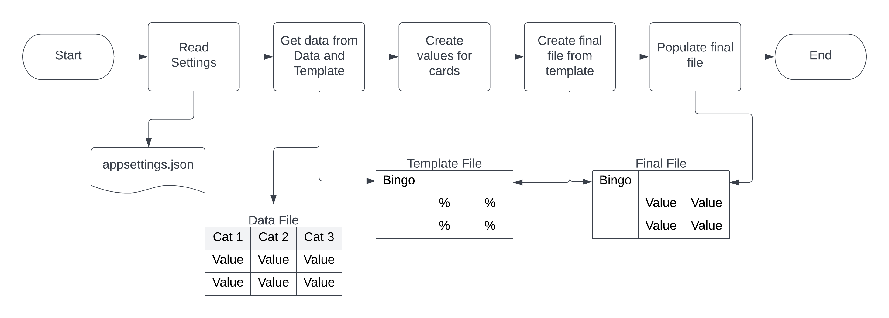

# MingelBingoCreator  

This is a project used to create customizable mingle bingo or Getting-to-know-you-bingo cards (mingelbingo in Swedish) for parties, weddings and more.

## Solution overview



A working solution consists of
- The project code
- An appsettings.json file
- A Google Project with Sheets read and write permissions 
- A Data spreadsheet (Google Sheets currently supported)
- A Template spreadsheet (Google Sheets currently supported)

## About Mingelbingo/Getting to know you bingo

Mingelbingo is a fairly well known activity which is great to help groups of people to mix and get to know each others.
The rules are simple: 
- Everone get's a card with different statements.
- The statements can be descriptions, background, preferences, future plans, secrets or anything which can be connected to someone.
- If person A has a card with one statement "Has blue socks." and then finds Person B who has blue socks, then Person A writes the name of Person B next to the statement.
- The first person who get's 1 or 2 full rows or the whole board wins.

Usually the competetion is not very important and after 20-30 minutes it can feel natural to either find the winner or slowly transition to the next phase of the event.

If people have as many different statements as possible the game will be more fun. Time spent coming up with the data sheet is well worth it.

## Setup  

1. Create a Google Project with Sheets API Read and write permissions [How to create a Google Cloud project](https://developers.google.com/workspace/guides/create-project)
2. Add yourself as tester in OAuth menu and get OAuth credentials as json. 
3. Create data spreadsheet and template spreadsheet
4. Download source code and build
5. Create appsettings.json file in the directory next to the new binary (or configure file properties as "Copy Always" for the dotnet build)
6. Put OAuth credentials file with appsettings.json
7. Run and press "Continue" when browser shows Google's safety warning.

## Appsettings  

The appsettings.json file needs the following:
- googleSheetsOptions
  - applicationName: The name of the Application in Google Cloud Console
  - credentialsFileName: Name of the local OAuth file
  - dataSheetId: ID of the data sheet. [How to find ID](https://developers.google.com/sheets/api/guides/concepts)
  - dataSheetTabName: Name of the tab with the data, for example "Sheet01"
  - placeHolderValue: A value or symbol that is used to decide which cells in the template file to replace with values
  - templateSheetId: ID of the template sheet. [How to find ID](https://developers.google.com/sheets/api/guides/concepts)
  - templateSheetTabName: Name of the tab with the template, for example "Sheet01"
- exportOptions
  - numberOfCards: The number of bingo cards needed
  - finalFileName: The name to be given to the final file (a time based suffix is added to prevent duplicate name complications).

Example appsettings.json file:

```
{
  "googleSheetsOptions": {
    "applicationName": "MingelBingoCreator",
    "credentialsFileName": "client_secret.json",
    "dataSheetId": "1ZVvRITpAIQKYQNGsfHF2ezF5JZVfmWUjkhQHlA1qp-s",
    "dataSheetTabName": "data",
    "placeHolderValue": "%",
    "templateSheetId": "1pIE9Oi-BkxyHHWnUCX_AMxFsxGcLN63k-hSd6_eOjqs",
    "templateSheetTabName": "template"
  },
  "exportOptions": {
    "numberOfCards": 30,
    "finalFileName":  "MingelBingo_final"
  }
}
```

## The template  

The template file can be a custom made Google Spreadsheet with the symbol '%' marking the cells where statements should be inserted.

Currently only one rectangular area per card (Spreadsheet tab/sheet) is supported.

Note: Currently templates using more than the Z-column are not supported.

[Link to example template](https://docs.google.com/spreadsheets/d/1pIE9Oi-BkxyHHWnUCX_AMxFsxGcLN63k-hSd6_eOjqs/edit#gid=0)

## The data file  

The statements used to populate the template are collected from a Google Spreadsheet grouped in columns with headings.

[Link to example data file](https://docs.google.com/spreadsheets/d/1ZVvRITpAIQKYQNGsfHF2ezF5JZVfmWUjkhQHlA1qp-s/edit#gid=0)

### Categories and Tags  

The names of the headings can be helpful when coming up with ideas, but will not show up in the final file.

It's possible to add a tag in the heading to control the creation of the bingo cards. 

#### #OnEachBoard_X  

If this tag is present in the columns top row, then, X values in this column will be inserted into every bingo card.
This is useful if one or more statements should be on every card.

#### #UniquePerBoard_X  

If this tag is present in the columns top row, then, X values in this column will be inserted into every bingo card, but every value will only appear once among all the different cards. 
This is useful for missions or for special ones that 

#### #Ignore  

If this tag is present in the columns top row, then all values in this column will be ignored.

## The final file  

The final file that's generated is a copy of the template spreadsheet created in the users root Google Drive folder. The file will have tabs/sheets for each card.

## Future development  

- [x] Unique tag
- [x] Ignore tag
- [x] Flowchart of solution
- [x] Move range creation to before copying template file to avoid re-reading for each template
- [x] Readme file
- [x] Refactor card values creation
- [ ] Implement Dependency Injection
- [ ] Add support for discontinuous areas in template to allow completely custom shaped bingo cards
